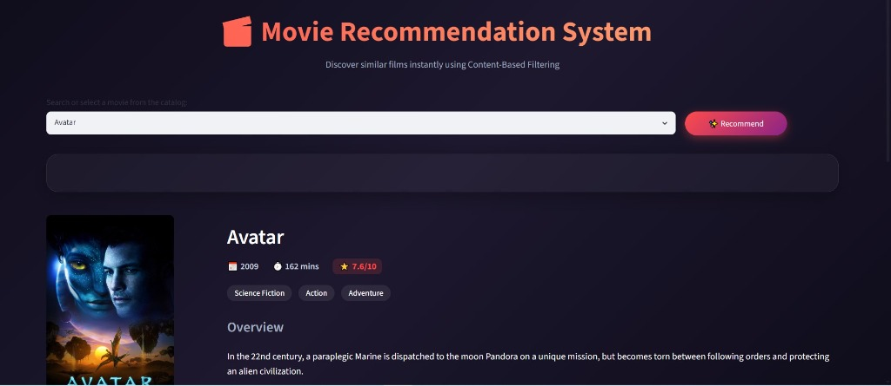
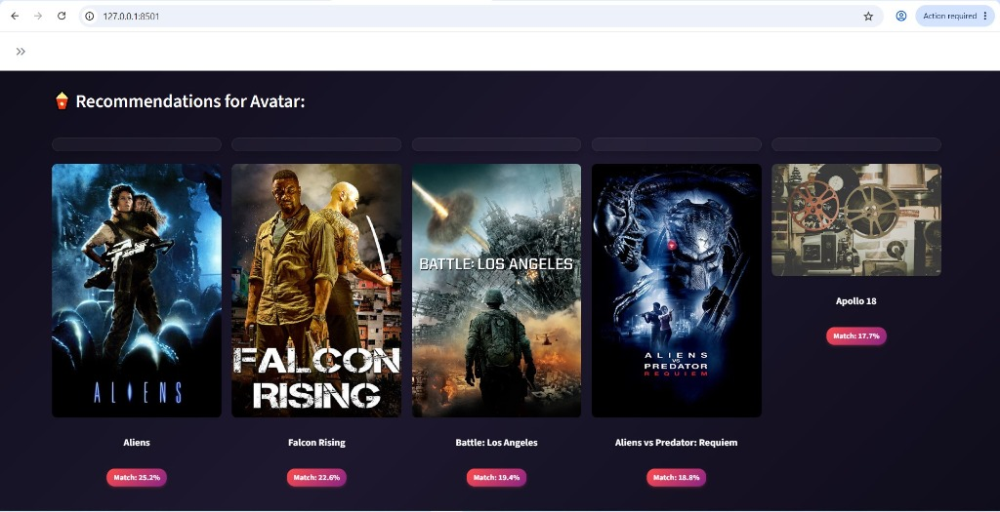

## Deployment

The application is deployed on Streamlit Community Cloud and can be accessed at:
https://erdxb2enxjddhtwuqxxnhd.streamlit.app/

# Movie Recommendation System

A content-based movie recommendation system built with Python, Pandas, NLTK, Scikit-Learn, and Streamlit. This application recommends five similar movies based on metadata including genres, keywords, cast, crew, and overviews from the TMDB 5000 dataset.

## Screenshots

### Application Dashboard


### Movie Recommendations


## Features

- Natural Language Processing: Advanced text cleaning, tokenization, and Porter Stemming via NLTK.
- Vectorization: TF-IDF vectorization and cosine similarity calculations to compute relationship scores between movies.
- Web Dashboard: A clean, glassmorphic Streamlit user interface featuring a searchable dropdown and recommendation cards with similarity scores.
- Automatic Training: Built-in self-healing functionality to train the model directly via the Streamlit interface if model files are missing.
- TMDB API Integration: Fetches real-time movie posters, durations, and ratings dynamically.

## How it Works

1. **Data Preprocessing**: The system merges the TMDB 5000 movies and credits datasets. It extracts key attributes: genres, keywords, top 3 cast members, and the director's name.
2. **Text Cleaning**: Spaces are removed from names (e.g., "Johnny Depp" becomes "JohnnyDepp") to create unique single-token tags. 
3. **Stemming**: Words are stemmed to their base form (e.g., "loving" and "love" are consolidated) to improve match accuracy.
4. **Vectorization**: The tag list is converted into a matrix of TF-IDF features.
5. **Similarity Calculation**: A cosine similarity matrix is calculated for all movies. When a user requests recommendations, the system retrieves the top 5 movies with the highest similarity score.

## Project Structure

- data/: CSV files containing movie details and credits.
- notebooks/: Jupyter notebook for exploratory data analysis.
- src/: Core Python modules for preprocessing, training, and recommendations.
- app.py: Streamlit dashboard application.
- requirements.txt: Python package dependencies.
- screenshots/: Images of the user interface.

## Installation

1. Clone the repository and navigate to the project directory:
   ```bash
   git clone https://github.com/Aditya9700/Movie-Recommendation-System-ML.git
   cd Movie-Recommendation-System-ML
   ```

2. Install the required dependencies:
   ```bash
   pip install -r requirements.txt
   ```

## Usage

### Training the Model
To process the data and generate the similarity matrix:
```bash
python src/train.py
```
This saves movies.pkl, similarity.pkl, and vectorizer.pkl to the root directory.

### Running the App
To start the Streamlit web dashboard:
```bash
streamlit run app.py
```
Access the application locally at http://localhost:8501.

